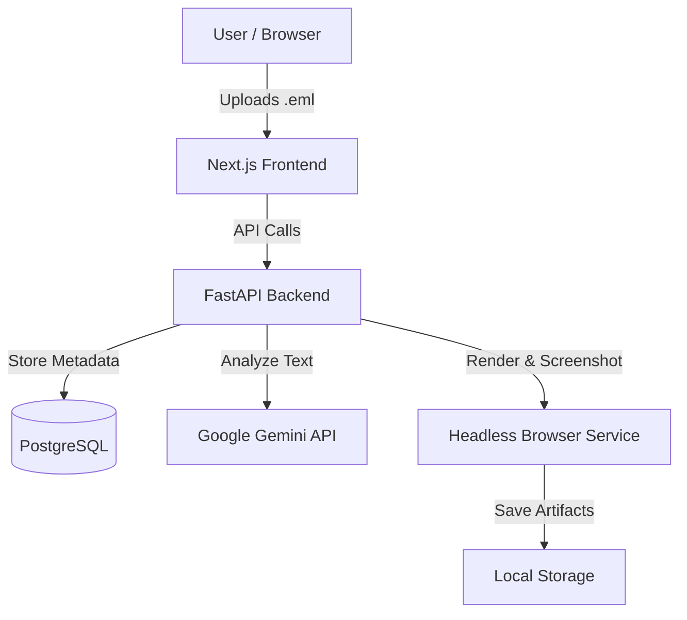

# 🛡️ PhishNet: AI-Powered Email Security Sandbox

**PhishNet** is a secure, localized environment for analyzing suspicious emails. It combines **Google Gemini AI** with robust **heuristic analysis** to detect phishing attempts, while providing a sandboxed "Safe Preview" to view malicious content without risk.


## 🚀 Key Features

* **🧠 AI-First Detection Engine:** Uses **Google Gemini 2.5 Flash** (with auto-discovery) to analyze email context, intent, and coercion.
* **🛡️ Robust Fallback Heuristics (V7):** A "Unbreakable" backup layer that catches technical threats (Raw IPs, Punycode, Link Mismatches) even if AI fails.
* **🧪 Open Safely Mode:** Renders emails in a headless browser sandbox (Runner) to capture screenshots and extract links without exposing your local machine.
* **🔍 Deep Link Analysis:** Detects deceptive links (e.g., `paypal-support.com` vs `paypal.com`) using intelligent domain root matching.
* **🔐 Privacy Focused:** Self-hosted via Docker. Your emails stay on your machine (except for the text sent to Gemini API for analysis).


## Detection Methodology

PhishNet's heuristic engine applies six independent checks to every email. Each targets a specific attacker technique:

- **Raw IP Links** — Commodity phishing kits often skip domain registration and host directly on IP addresses. Legitimate services virtually never send emails with raw IP links.
- **Punycode / IDN Homograph Domains** — Attackers register internationalized domain names that visually mimic legitimate domains (e.g., `pаypal.com` using Cyrillic 'а' instead of Latin 'a'). PhishNet decodes punycode and flags visually deceptive domains.
- **Link-Text Mismatches** — Social engineering technique where the displayed URL text differs from the actual href destination. For example, showing "https://paypal.com" but linking to "https://evil.com/harvest".
- **Domain Root Matching** — Catches subdomain abuse and lookalike domains. `paypal-support.com` is NOT `paypal.com`. PhishNet extracts and compares domain roots to detect impersonation.
- **Financial Scam Phrases** — Pattern matching for common social engineering language: "compensation fund", "winning notification", "unclaimed inheritance" — phrases statistically overrepresented in phishing campaigns.
- **Urgency Indicators** — Detects pressure language ("account suspended", "action required", "verify immediately") used to bypass rational decision-making.

> **Note:** The heuristic engine runs independently of the AI model, ensuring detection continues even if the LLM is unavailable or returns ambiguous results.

---

## 🏗️ Architecture

PhishNet runs as a multi-container Docker application:



---

## 🛠️ Prerequisites

* **Docker Desktop** (Running and updated)
* **Google Gemini API Key** (Free tier is sufficient)
* [Get a free key here](https://aistudio.google.com/app/apikey)


---

## ⚡ Quick Start Guide

### 1. Clone the Repository

```bash
git clone [https://github.com/Mananshah237/phishnet.git](https://github.com/Mananshah237/phishnet.git)
cd phishnet

```

### 2. Configure Environment

Create a `.env` file in the root directory. You can copy the example below:

```ini
# .env file

# --- Database (Default) ---
POSTGRES_USER=phishnet
POSTGRES_PASSWORD=phishnet
POSTGRES_DB=phishnet

# --- AI Configuration ---
# Get Key: [https://aistudio.google.com/app/apikey](https://aistudio.google.com/app/apikey)
GEMINI_API_KEY=AIzaSyDxxxxxxxxxxxxxxxxxxxxxxxxxxxxxxx

# (Optional) OpenAI Support - Leave empty to use Gemini
OPENAI_API_KEY=
OPENAI_MODEL=gpt-4o-mini

```

### 3. Launch with Docker

Run the following command to build and start the system.
*Note: The first run takes a few minutes to download the AI and Browser images.*

```powershell
docker compose up -d --build

```

### 4. Access the App

* **Frontend:** [http://localhost:3000](https://www.google.com/search?q=http://localhost:3000)
* **API Docs:** [http://localhost:8000/docs](https://www.google.com/search?q=http://localhost:8000/docs)

---

## 🖥️ Usage

1. **Upload:** Drag and drop an `.eml` file into the dashboard.
2. **Analysis:** The system runs two parallel checks:
* **AI:** Asks Gemini "Is this phishing?" (Contextual analysis).
* **Heuristics:** Checks for hard indicators (IP links, mismatched domains).


3. **Result:** You get a Score (0-100) and a Verdict (Safe, Suspicious, Phishing).
4. **Open Safely:** Click "Open Safely" to render the email in a remote browser and see what it looks like without clicking anything locally.

---

## Sample Analysis Output

```
Email: "Your PayPal account has been limited"
From: service@paypa1-support.com

Risk Score: 87/100 — PHISHING

AI Verdict: phishing
AI Reasons:
  - Sender domain "paypa1-support.com" impersonates PayPal
  - Contains urgent language pressuring immediate action
  - Links point to non-PayPal domains

Heuristic Flags:
  ⚠ Domain root mismatch: "paypa1-support.com" ≠ "paypal.com" (+40)
  ⚠ Urgency language detected: "account has been limited" (+25)
  ⚠ Link-text mismatch: displayed URL differs from href (+40)

Final Score: 87 (AI: 75, boosted by heuristic guardrails)
Verdict: PHISHING
```

---

## Security Architecture

The "Open Safely" sandbox exists because raw emails are hostile documents:

- **Tracking pixels, JavaScript, and auto-loading external resources** embedded in emails can fingerprint the analyst's machine — leaking IP, OS, browser version, and screen resolution to the attacker.
- **Opening links directly** exposes your IP, browser fingerprint, and session to the attacker, confirming the target is actively investigating.
- **PhishNet's headless Chromium sandbox** renders in isolation with a default-deny network policy. The browser instance runs inside a dedicated container with no access to the host network or filesystem.
- **Only the target origin is optionally allowed** — all other requests (tracking pixels, third-party scripts, analytics) are blocked at the network level.
- **Output is non-interactive:** screenshots + extracted text + IOCs — no executable content reaches the analyst. What you see is a static capture, not a live page.
- **The runner container is ephemeral** — each render job starts clean with no persistent state. Cookies, localStorage, and any injected payloads are destroyed when the job completes.

---

## 🔧 Troubleshooting

### "AI analysis unavailable; using heuristics"

* **Cause:** The container can't see your API key, or the key is invalid.
* **Fix:**
1. Check your `.env` file.
2. Run: `docker compose exec api env` to confirm the key is loaded.
3. If not, force recreate: `docker compose up -d --force-recreate api`


### "NetworkError" in Frontend

* **Cause:** The API container crashed or isn't ready.
* **Fix:** Check logs with `docker compose logs -f api`. If it's a syntax error, rebuild with `docker compose up -d --build api`.

### Gemini 404 / Model Not Found

* **Fix:** The system now has **Auto-Discovery**. It will automatically try `gemini-2.5-flash`, `1.5-flash`, and `1.5-pro` until it finds one your key supports. Just restart the API container to re-trigger discovery.

---

## 📂 Project Structure

* **`apps/api`**: Python FastAPI backend (Logic, DB, AI integration).
* **`apps/web`**: Next.js Frontend (UI, Uploads).
* **`apps/runner`**: Node.js/Puppeteer service for safe rendering.
* **`artifacts/`**: Stores screenshots and analyzed email data locally.

---

## 📜 License

MIT License. Use responsibly for educational and defensive security purposes.

```

```
